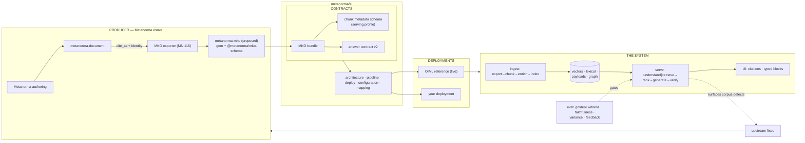

# Ecosystem — the graph path to success

The critical path: producer emits the contract → the format gets a stable
versioned home → deployments consume it → evaluation gates every change →
serving surfaces corpus defects → upstream fixes → a better corpus. The
reference deployment proves each hop with measurements (see README).
